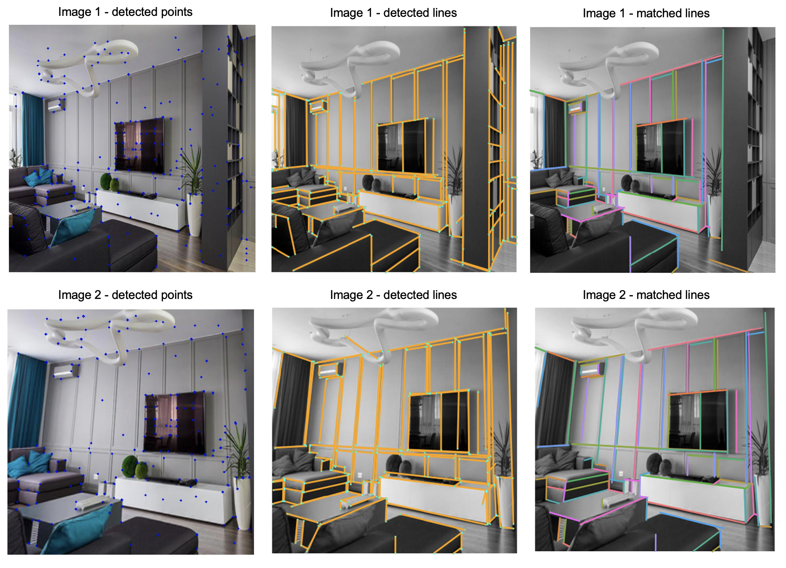

# Joint-PL - Joint point and line detection and description

This repository contains the implementation of the project: Joint-PL - Joint point and line detection and description. This project is conducted as ETH Zürich Master Semester Project under the supervision of 
[Rémi Pautrat](https://github.com/rpautrat).

Joint-PL is the first deep network for joint line and point detection and
description. In this work, we innovatively construct point and line
descriptor based on the shared dense description map. The proposed model achieves a reasonable
performance margin compared to the state-of-the-art with less inference
time.  

## Demos

Point detection, line detection and matching:


Line matching under extreme viewpoint and scale changes:


## Usage

### Installation

We recommend using this code in a Python environment (e.g. venv or conda). The following script installs the necessary requirements with pip:
```bash
pip install -r requirements.txt
```

Set your dataset and experiment paths by modifying the variables "EXPER_PATH" and "DATA_PATH" in the file `JointPL/settings.py`.

Install the Python package:
```bash
pip install -e .
```

### Dataset

We used the processed [Wireframe dataset](https://github.com/huangkuns/wireframe) in the [F-Clip work](https://github.com/Delay-Xili/F-Clip) to train and test our model. You can download this dataset from this [link](https://drive.google.com/file/d/1q8pQzYBJPh3brHUhjkVIxfbLk0XEigIe/view?usp=sharing).

In order to check the generalization ability of our model, we also test it on [HPatches dataset](https://github.com/hpatches/hpatches-dataset) and processed [York Urban dataset](https://www.elderlab.yorku.ca/resources/york-urban-line-segment-database-information/) in the [F-Clip work](https://github.com/Delay-Xili/F-Clip). You
can download them separately by [link1](http://icvl.ee.ic.ac.uk/vbalnt/hpatches/hpatches-sequences-release.tar.gz) and [link2](https://drive.google.com/file/d/1lapVcNtw7SNzH8cpHj2H6tIzyAom4MJe/view?usp=sharing).

### Training your own model

To train a model execute:
```bash
python3 -m JointPL.train experiment_name --conf JointPL/configs/config_name.yaml
```
It creates a new directory `experiment_name/` in `EXPER_PATH` and dumps the configuration, model checkpoints, logs of stdout, and [Tensorboard](https://pytorch.org/docs/stable/tensorboard.html) summaries.

### Pretrained models

We provide the checkpoints of two pretrained models:
- [checkpoint_best.tar](https://drive.google.com/file/d/1BivT6Oel1mgrdAVgFzbfKDJdVLjMRgl_/view?usp=sharing): Joint-PL model that achieves the best performance on the validation set.
- [checkpoint_34.tar](https://drive.google.com/file/d/1g3szQFUtnINYtd-ZOWIckKnEjBUzoAWa/view?usp=sharing): Joint-PL model derived from the last training epoch.
 
Note that you do not need to untar the models, you can directly place them in `/output/joint_pl_pretrained_model`.

To evaluate the point detector and descriptor performance, execute:
```bash
python3 -m JointPL.evaluation.evaluate_point --model joint_model --dataset Wireframe/HPatches
```

To evaluate the line detector performance, firstly generate predictions of line locations in npz.file by running:
```bash
python3 -m JointPL.evaluation.validate_line --model joint_pl_pretrained_model --dataset Wireframe/York --file best/last
```
then get the sAP value of the trained model by running:
```bash
python3 -m JointPL.evaluation.evalute_line --model joint_pl_pretrained_model --dataset Wireframe/York --file best/last
```

### How to use it
You can directly run codes in `JointPL/visualization` to visualize detected points and lines and matched lines. Especially 
you can run `JointPL/visualization/vis_line_match.py` locally in CPU configuration. You can generate lines detection and 
description file used in `JointPL/visualization/vis_line_match.py` by running `JointPL/visualization/line_match_process.py`.

## Acknowledgments
This work is supervised by [Rémi Pautrat](https://github.com/rpautrat). Sincere thanks to him for his help and guidance. The codes of model and
evaluation parts are borrowed or modified from [KeyPointNet](https://github.com/TRI-ML/KP2D) and [F-Clip](https://github.com/Delay-Xili/F-Clip) works.
Many thanks to their wonderful works and repos.